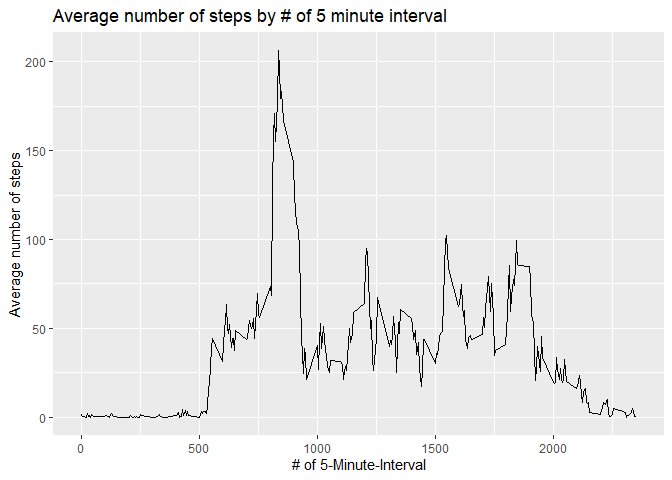
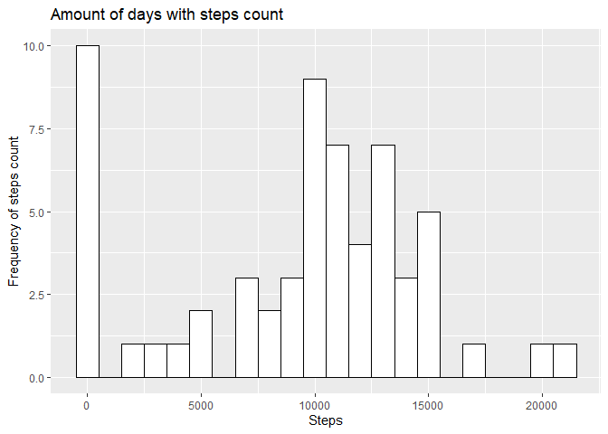
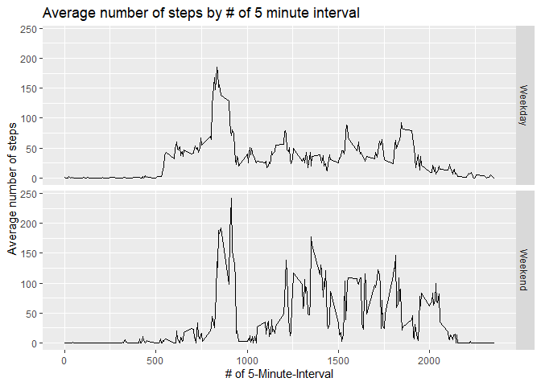

## Introduction
This document contains my solution for course project 1 of the Coursera course "Reproducible Research" (Specialization "Data Mining"). The document has been created using R Markdown and the knitr framework.
Course project 1 deals with the analysis of data resulting from an activity monitoring device. 
All coding below has been executed in R IDE RStudio. Graphics have been plotted using the ggplot2 package. 


## Loading and preprocessing the data
At first, we load the libraries necessary for our evaluations and set the working directory of our coding to the place where this markup file is stored. So we are able to address the data file relatively. 
Afterwards we read in the data for this assignment from a .zip file. 
We set column names as indicated in the assignment and transform the values in column "Date" to the corresponding R data type. 


```r
#Loading libraries
library(dplyr)
```

```
## 
## Attaching package: 'dplyr'
```

```
## The following objects are masked from 'package:stats':
## 
##     filter, lag
```

```
## The following objects are masked from 'package:base':
## 
##     intersect, setdiff, setequal, union
```

```r
library(ggplot2)

#Setting working directory relatively to markdown file location
#curr_dir<-dirname(parent.frame(2)$ofile)
#setwd(curr_dir)

#Read in data and transform where necessary
data<-read.csv(unz("activity.zip", "activity.csv"),header=TRUE, sep=",", na.strings="NA", col.names=c("Steps", "Date", "Interval"))
data$Date<-as.Date(data$Date, format="%Y-%m-%d")

str(data)
```

```
## 'data.frame':	17568 obs. of  3 variables:
##  $ Steps   : int  NA NA NA NA NA NA NA NA NA NA ...
##  $ Date    : Date, format: "2012-10-01" "2012-10-01" ...
##  $ Interval: int  0 5 10 15 20 25 30 35 40 45 ...
```
As visible in the output, the resulting data frame contains 3 columns:

* Steps: Number of steps taken in a 5 minute interval
* Date: Date on which the measurement was taken
* Interval: Identifier for the 5 minute interval

## What is mean total number of steps taken per day?
In this chapter, we calculated the total number of steps taken per day. Here, we applied the dplyr package to group the data by date.
Furthermore, we drew a histogram of the total number of steps taken each day (using the ggplot framework).


```r
# Calculate total number of steps per day
steps_per_day<-data%>%group_by(Date)%>%summarise(Steps=sum(Steps))

# Histogram of the total number of steps taken per day
g1<-ggplot(steps_per_day, aes(x=Steps))+
  geom_histogram(binwidth=1000, colour="black", fill="white")+
  xlab("Steps")+ylab("Frequency of steps count")+
  ggtitle("Amount of days with steps count")
g1
```

```
## Warning: Removed 8 rows containing non-finite values (stat_bin).
```

<!-- -->

In addition, we had to calculate the mean and median of the total number of steps taken per day:

* Mean: 1.0766189\times 10^{4}
* Median: 1.0765\times 10^{4}

In this calculation, the NA values were ignored.

## What is the average daily activity pattern?
In this chapter, we had to visualize the average daily activity pattern. 
This means, we had to calculate the average steps per 5 minutes interval, averaged over all observed days.
Afterwards we drew a time series plot to visualize how (in average) the step amount per intervall changes during the day. 

```r
#Calculate average steps per time interval, ignoring NAs
steps_per_interval<-data%>%group_by(Interval)%>%summarise(Avg_steps=mean(Steps, na.rm=TRUE))

#Drawing time series plot
g2<-ggplot(steps_per_interval, aes(x=Interval, y=Avg_steps))+
  geom_line()+
  xlab("# of 5-Minute-Interval")+ylab("Average number of steps")+
  ggtitle("Average number of steps by # of 5 minute interval")
g2
```

<!-- -->

```r
#Calculating the time interval in which (in average) the biggest amount of steps occurs
max_steps_i=which.max(steps_per_interval$Avg_steps)
max_steps_interv=steps_per_interval[max_steps_i,]$Interval
```

The maximum average number of steps (i.e. 206.1698113) occurs in time interval 835.

## Imputing missing values
Finally, we were asked to impute the missing values in column "steps". 
All in all, in 2304 rows there occurred an NA value. 

We applied the following imputing strategy:
In case that in row x column "steps" has value NA, we determine the closest neighboring rows which have a "steps" value unequal to NA. Then we calculate the average "steps" value of these rows and assume it for x.
(In case that we reach the start/end of the dataset in lower or upper direction, we consider only the nearest not-NA value in opposite direction).

After applying our imputing method on the dataset, we draw again a histogram of the total number of steps taken each day.


```r
#Strategy: Take average of neighboring not-na-values before and after the row with value NA
impute_na<-function(x){
  new_x=data.frame(x)
  for (i in 1:nrow(new_x)){
    if(is.na(new_x[i,1])){
      lower=i
      while(is.na(new_x[lower,1])&&lower>1){
        lower=lower-1
      }
      
      upper=i
      while(is.na(new_x[upper,1])&&upper<nrow(new_x)-1){
        upper=upper+1
      }
      
      subst=NA
      #Lower end of dataset has been reached
      if(is.na(new_x[lower,1])&&!is.na(new_x[upper,1])){
        subst=new_x[upper,1]
      }
      #Upper end of dataset has been reached
      else if(!is.na(new_x[lower,1])&&is.na(new_x[upper,1])){
        subst=new_x[lower,1]
      }
      #Both neigboring rows somehwere in the middle of the dataset
      else if(!is.na(new_x[lower,1])&&!is.na(new_x[upper,1])){
        subst=mean(new_x[lower,1], new_x[upper,1])
      }
      #Hypothetic case: Dataset contains only NA values, thus no imputing possible
      else{
        subst=NA
      }
      
      new_x[i,1]<-subst
    }
  }
  return(new_x)
}
#Applying the imputing method to our dataset
new_data<-impute_na(data)

#Drawing a histogram of the total number of steps per day
steps_per_day2<-new_data%>%group_by(Date)%>%summarise(Steps=sum(Steps))
g3<-ggplot(steps_per_day2, aes(x=Steps))+
  geom_histogram(binwidth=1000, colour="black", fill="white")+
  xlab("Steps")+ylab("Frequency of steps count")+
  ggtitle("Amount of days with steps count")
g3
```

<!-- -->

```r
mean_steps2<-round(mean(steps_per_day2$Steps), digits=5)
md_steps2<-round(median(steps_per_day2$Steps), digits=5)
```

The histogram shows us, that after the imputing procedure, there are far more days with a total step count zero or close to zero. The reason for this is that in many cases, the NA values are not don't occur as single value or in small chunks in the middle a day, but hold for the whole day. So the value of the end interval of the previous day and the value of the start interval of the following day are taken for imputing. And due to the night, this value mostly is very small. 

In summary, the new mean/median values are:

* Mean: 9354.22951
* Median: 1.0395\times 10^{4}

As expected, the values are lower than before the imputation.

## Are there differences in activity patterns between weekdays and weekends?
Finally, we enriched the dataset with information about the weekday corresponding to the date. 
Using two time-series plots, we compared the average amount of steps per intervall between weekdays and weekend days.


```r
#Appending an additional column to the frame containing the weekday information
new_data<-new_data%>%mutate(Day=factor(ifelse(as.POSIXlt(new_data$Date)$wday>5, "Weekend", "Weekday")))

#Grouping by interval number and day type
steps_per_interval_wd<-new_data%>%group_by(Interval, Day)%>%summarise(Avg_steps=mean(Steps))

#Plotting time series for the two day types
g4<-ggplot(steps_per_interval_wd, aes(x=Interval, y=Avg_steps))+
  geom_line()+
  facet_grid(rows=vars(Day))+
  xlab("# of 5-Minute-Interval")+ylab("Average number of steps")+
  ggtitle("Average number of steps by # of 5 minute interval")
g4
```

<!-- -->

The plots clearly show that in weekdays, the number of steps in early morning hours is in average higher. In contrast, in weekend days, the average number of steps in the hours of late evening is higher. 

